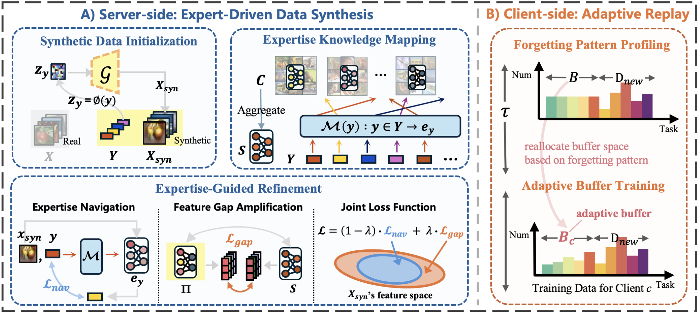

<h1 align="center">CAN: Leveraging Clients As Navigators for Generative Replay in Federated Continual Learning</h1>

<p align="center"><em>Xuankun Rong&dagger;, Jianshu Zhang&dagger;, Kun He, Mang Ye*</em></p>

<div align="center">

</div>

<h2> 🙌 Abstract </h2>

Generative replay (GR) has been extensively validated in continual learning as a mechanism to synthesize data and replay past knowledge to mitigate forgetting. By leveraging synthetic rather than real data for the replay, GR has been adopted in some federated continual learning (FCL) approaches to ensure the privacy of client-side data. While existing GR-based FCL approaches have introduced improvements, none of their enhancements specifically take into account the unique characteristics of federated learning settings. *Beyond privacy constraints, what other fundamental aspects of federated learning should be explored in the context of FCL?* In this work, we explore the potential benefits that come from emphasizing the role of clients throughout the process. We begin by highlighting two key observations: (a) Client Expertise Superiority, where clients, rather than the server, act as domain experts, and (b) Client Forgetting Variance, where heterogeneous data distributions across clients lead to varying levels of forgetting. Building on these insights, we propose **CAN** (**C**lients **A**s **N**avigators), highlighting the pivotal role of clients in both data synthesis and data replay. Extensive evaluations demonstrate that this client-centric approach achieves state-of-the-art performance. Notably, it requires a smaller buffer size, reducing storage overhead and enhancing computational efficiency.

<h2 id="citation"> 🥳 Citation </h2>

Please kindly cite this paper in your publications if it helps your research:

```bibtex
@inproceedings{rong2025can,
  title={CAN: Leveraging Clients As Navigators for Generative Replay in Federated Continual Learning},
  author={Rong, Xuankun and Zhang, Jianshu and He, Kun and Ye, Mang},
  booktitle={ICML},
  year={2025}
}
```